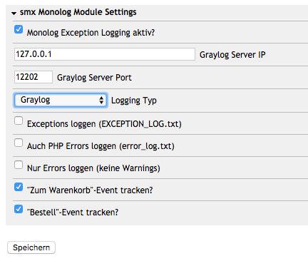
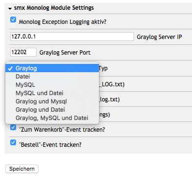

# smxMonologOxid

A generic logging module using Monolog via [smxMonolog](https://github.com/shoptimax/smxmonolog.git)

This module can log to files, MySQL and Graylog or any combination of them.

 


## Installation

You need to install the __smxmonolog__ lib to use this module. Add this to your main composer.json file:

```json
  "repositories": {
    "shoptimax/smxmonolog": {
      "type": "vcs",
      "url": "https://github.com/shoptimax/smxmonolog.git"
    }
  },
  "require": {
    "shoptimax/smxmonolog": "*"
  },
```

Then run "composer update" in your shop directory and activate the module in the OXID backend.

## Usage

Configure the module in the module settings in the OXID backend, choose the logging methods you want to use (files, mysql, graylog or combinations of those)
and configure your graylog server data if used.

## Usage from other modules

If you want to log from other modules in OXID, you should first check if the monolog module is active and then
call the log method like this:
```php
<?php  
  if (class_exists('smxmonologoxidlogger')) {
      $smxmonologoxidlogger = new smxmonologoxidlogger();
      if ($smxmonologoxidlogger
          && ($logger = $smxmonologoxidlogger->getLogger()) != null
      ) {
          $logger->log("Hello, world!", array("foo" => "bar"), 'INFO');
      }
  }
?>
```

The array (2nd parameter in the log function) can be used to __send additional fields__ to graylog, the example will be visible in graylog as 
field "ctx_foo" with value "bar".
The 3rd parameter is the __log level__, available are [all Monolog log levels](https://github.com/Seldaek/monolog/blob/master/doc/01-usage.md#log-levels) (PSR).

You can also use the $logger like this, see [usage info](https://github.com/shoptimax/smxmonolog#usage):
```php
<?php
    // change log level
    $logger->setLogLevel('NOTICE');
    $logger->log("Hello, Notice!");
    // set a custom log level for a message
    $logger->log("Hello, Custom Alert!", array(), 'ALERT');
    // use dedicated log functions with fix level
    $logger->debug("Will have {food} for {meal}", array('food' => 'fish', 'meal' => 'breakfast'));
    $logger->warning("Testing this warning");
    $logger->error("Doh, an error!");
?>
```

## Extras

The module will log most of the log messages that OXID sends to the php error log and to its own "EXCEPTION_LOG.txt" file.
There is one exception though - missing functions will not be logged since OXID throws a really hardcore __oxSystemComponentExcption__
in *"oxsupercfg::__call()"* which can't be handled via a module. So to track those exceptions with monolog, too, you have to "patch" oxsupercfg.php unfortunately.
Change the *__call()* function like this and add the logging method below:

```php
<?php
    public function __call($sMethod, $aArgs)
    {
        if (defined('OXID_PHP_UNIT')) {
            if (substr($sMethod, 0, 4) == "UNIT") {
                $sMethod = str_replace("UNIT", "_", $sMethod);
            }
            if (method_exists($this, $sMethod)) {
                return call_user_func_array(array(& $this, $sMethod), $aArgs);
            }
        }

        // smx_sm: added monolog hook!
        $this->_logEvent("Function '$sMethod' does not exist or is not accessible! (" . get_class($this) . ")", 'EMERGENCY');
        // smx_sm: end hook

        throw new oxSystemComponentException("Function '$sMethod' does not exist or is not accessible! (" . get_class($this) . ")" . PHP_EOL);
    }
    /**
     * Track via monolog
     * smx_sm: added this function for Monolog logging
     *
     * @param string $msg   The log message
     * @param string $level The log level
     *
     * @return null
     */
    private function _logEvent($msg, $level = 'INFO')
    {
        $oConfig = oxRegistry::getConfig();
        $sShopId = $oConfig->getShopId();
        $blLogErrors = $oConfig->getShopConfVar('smxMonologLogExc', $sShopId, 'module:smxmonologoxid');
        $smxmonologoxidlogger = new smxmonologoxidlogger();
        if ($blLogErrors && $smxmonologoxidlogger
            && ($logger = $smxmonologoxidlogger->getLogger()) != null
        ) {
            $logger->log($msg, array(), $level);
        }
    }
?>    
```
